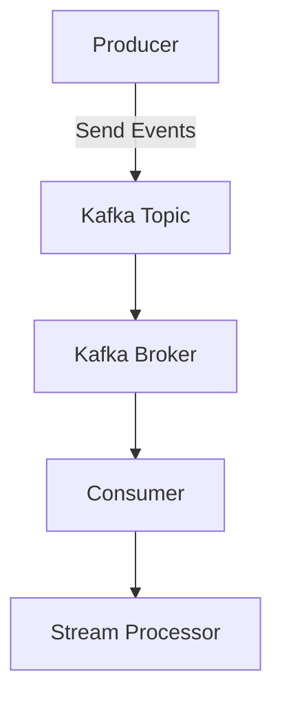

# 📦 KAFKA-Guide

A lightweight Kafka integration toolkit for building scalable, event-driven applications. Includes producer/consumer templates, topic management utilities, and real-world examples for stream processing and microservice orchestration.

---

## 🧠 What is Apache Kafka?

Apache Kafka is a distributed event streaming platform used for high-performance data pipelines, streaming analytics, data integration, and mission-critical applications. It enables applications to publish, subscribe to, store, and process streams of records in real time.

---

## 📸 Kafka Architecture

  
*Source: [CloudDuggu](https://www.cloudduggu.com/kafka/architecture/)*

Kafka consists of:
- **Producers**: Send records to Kafka topics.
- **Consumers**: Read records from topics.
- **Topics**: Categories to which records are sent.
- **Brokers**: Kafka servers that store and forward data.
- **Zookeeper**: Manages cluster metadata and leader election.

---

## 🚀 Features of KAFKA---Guide

- 🧩 Plug-and-play **Producer/Consumer templates**
- 🛠️ Topic creation and management utilities
- 🔄 Stream processing examples using Kafka Streams
- 🧵 Microservice orchestration patterns
- 📈 Monitoring hooks and logging integration
- 🧪 Real-world use cases and test scenarios

---

## 🛠️ Prerequisites

Before installing, ensure the following are available:

| Requirement        | Version/Details           |
|--------------------|---------------------------|
| Java               | 8 or higher               |
| Apache Kafka       | 3.6.0 or compatible       |
| Zookeeper          | Bundled with Kafka        |
| Docker (optional)  | For containerized setup   |
| Git                | For cloning the repo      |

---

## 📥 Installation

### 1. Clone the Repository
```bash
git clone https://github.com/your-org/kafka-guide.git
cd kafka-guide
```

### 2. Start Kafka (Local)
```bash
# Start Zookeeper
bin/zookeeper-server-start.sh config/zookeeper.properties

# Start Kafka Broker
bin/kafka-server-start.sh config/server.properties
```

### 3. Install Toolkit Dependencies
```bash
npm install   # if using Node.js
# OR
pip install -r requirements.txt   # if using Python
```

---

## 🧪 Quick Start

### Produce a Message
```bash
python producer.py --topic test-topic --message "Hello Kafka!"
```

### Consume Messages
```bash
python consumer.py --topic test-topic
```

---

## 🔄 Kafka Workflow



---

## 📚 Real-World Examples

- 🛒 **E-commerce Order Pipeline**: Track orders, payments, and delivery events.
- 🚗 **Fleet Tracking System**: Stream GPS data from vehicles.
- 🧾 **Audit Logging**: Capture user actions across microservices.

---

## 📊 Monitoring & Metrics

- Integrate with **Prometheus** and **Grafana**
- Use **Kafka Manager** or **Confluent Control Center** for cluster insights

---

## 🧰 Utilities

- `topic-create.sh`: Create topics with replication and partitions
- `topic-list.sh`: List all topics
- `topic-delete.sh`: Delete a topic safely

---

## 🧠 Kafka Concepts Explained

| Concept         | Description |
|----------------|-------------|
| **Partition**   | Unit of parallelism in a topic |
| **Offset**      | Position of a message in a partition |
| **Consumer Group** | Multiple consumers sharing a topic |
| **Retention**   | Duration messages are stored |

---

## 📦 Toolkit Structure

```
kafka-guide/
├── producer.py
├── consumer.py
├── utils/
│   ├── topic_manager.py
│   └── config_loader.py
├── examples/
│   ├── ecommerce_pipeline.py
│   └── fleet_tracking.py
├── docs/
│   └── architecture.md
```

---

## 🧠 Learn More

- [Kafka Official Docs](https://kafka.apache.org/documentation/)
- [Kafka Streams](https://kafka.apache.org/documentation/streams/)
- [Confluent Kafka](https://www.confluent.io/)

---

## 🤝 Contributing

We welcome contributions! Please read our [CONTRIBUTING.md](CONTRIBUTING.md) for guidelines.

---

## 📄 License

This project is licensed under the MIT License - see the [LICENSE](LICENSE) file for details.

---

Would you like me to help generate a matching logo or GIF for this toolkit next?
